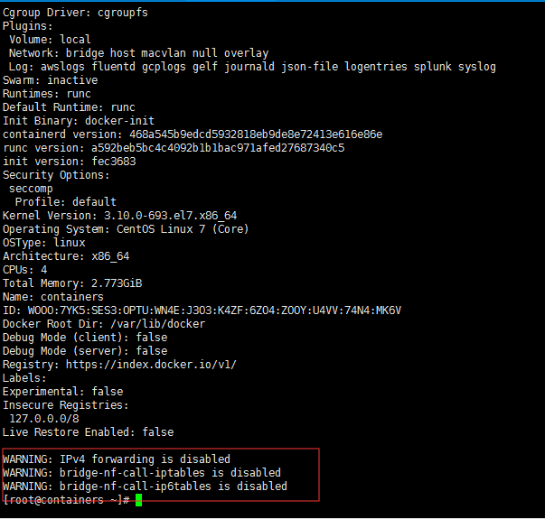

## 构建一个Cloud_Manager的镜像

```shell
# 获取初始镜像
[root@containers ~]# docker search ansible
[root@containers ~]# docker pull ansible/centos7-ansible

# 配置初始镜像得到自己的初始化镜像
[root@containers ~]# run -it ansible/centos7-ansible /bin/bash
[root@577fe1362017 ansible]#  yum install -y  sshpass   
[root@577fe1362017 ansible]# cp /opt/ansible/ansible/examples/ansible.cfg /etc/ansible/ansible.cfg   \\复制ansible配置文件，并修改host_key_checking = False
[root@577fe1362017 ansible]# vi /etc/ansible/ansible.cfg
[root@577fe1362017 ansible]# exit  \\测试ansible正常后退出容器

# 将容器保存为新镜像
[root@containers ~]# docker commit 577fe1362017
[root@containers ~]# docker tag b23dc1ea9d2e85e82fab812761375969873a5df021d8ab8899275bacf4e21765 ansible
```


**在构建自有镜像中遇到的问题:**

> 使用默认网络（桥接）创建的容器无法ping通宿主机

- 在宿主机下使用```docker info```可以看到如下信息：




- 解决办法: 

```shell
[root@containers ~]# cat /etc/sysctl.conf  \\添加一下内容
...
#
# for docker 
net.ipv4.ip_forward = 1
net.bridge.bridge-nf-call-ip6tables = 1
net.bridge.bridge-nf-call-iptables = 1
net.bridge.bridge-nf-call-arptables = 1
[root@containers ~]# sysctl -p
```

**出于安全考虑，Linux系统默认是禁止数据包转发的。所谓转发即当主机拥有多于一块的网卡时，其中一块收到数据包，根据数据包的目的ip地址将数据包发往本机另一块网卡，该网卡根据路由表继续发送数据包。这通常是路由器所要实现的功能。** 

**参考文档:  https://blog.51cto.com/13683137989/1880744**


> 镜像扁平化

```shell
[root@containers ~]# docker run -d ansible /bin/true
a64e10916079f4be853bf3425a43b2301e30992dfcb1f82a8509eda0c07aeae7
[root@containers ~]# docker export a64e10916079 | docker import - ansible
sha256:d60071b95acce755e0040062b8de73a05eac224a58ec8d3ba8f2685608cd6904
[root@containers ~]# docker images ansible
REPOSITORY          TAG                 IMAGE ID            CREATED             SIZE
ansible             latest              d60071b95acc        12 minutes ago      459MB
[root@containers ~]# docker history ansible
IMAGE               CREATED             CREATED BY          SIZE                COMMENT
d60071b95acc        41 seconds ago                          459MB               Imported from -
```

1. 运行一个简单的命令让容器可以快速退出，因为并不需要它处于运行状态
2. 运行docker export ，它把容器ID当做参数并输出文件系统内容的一个tar文件。这一操作被管道到docker import ,它将以TAR文件的内容作为输入创建一个镜像


**延伸：**

```
# 导出容器快照到本地文件，保存的是容器当时的状态，即容器快照
docker export 16168d4b66b1 > ubuntu.tar
# 从容器快照文件中再导入为镜像
cat ubuntu.tar | docker import - test/ubuntu:v1.0

# 将镜像保存为tar包，保存的是该镜像的所有历史记录
docker save centos > centos_save.tar
# 将镜像存储文件导入到本地镜像库
docker load < ./centos_save.tar
```

**这两者的区别： 这两者的区别在于容器快照文件将丢弃所有的历史记录和元数据信息（即仅保存容器当时的快照状态） ，而镜像存储文件将保存完整记录，体积也要大。** 


